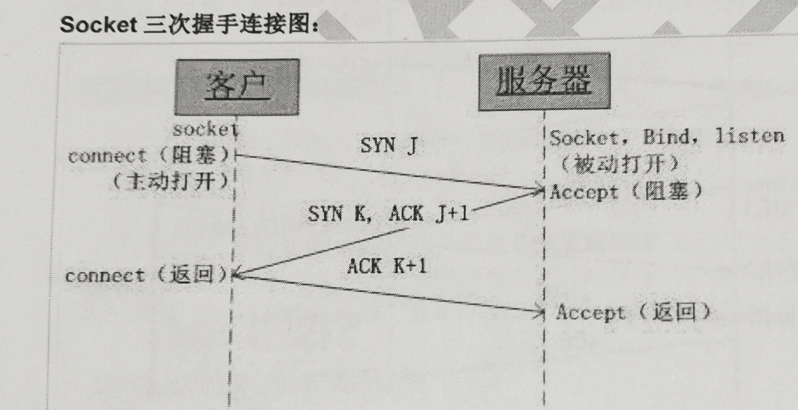
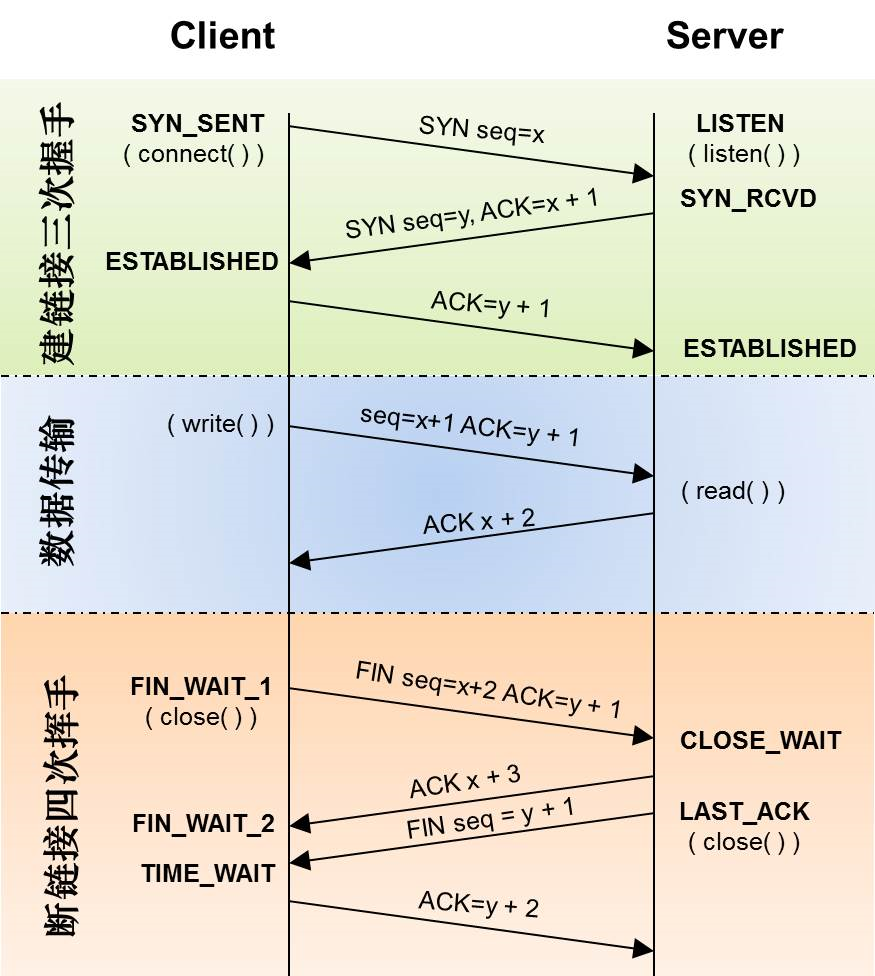

- [IPC](#ipc)
- [在Windows中线程的优先级](#在windows中线程的优先级)
- [多路复用](#多路复用)
- [用户态和内核态](#用户态和内核态)
- [Windows消息机制](#windows消息机制)
- [windows消息系统由哪几部分构成](#windows消息系统由哪几部分构成)
- [什么是消息映射](#什么是消息映射)
- [sendmessage vs postmessage](#sendmessage-vs-postmessage)
- [报文分片和TCP重组](#报文分片和tcp重组)
- [面向流和面向数据报](#面向流和面向数据报)
- [粘包会有什么问题，如何解决](#粘包会有什么问题如何解决)
- [TCP UDP 通信的基本步骤如下：](#tcp-udp-通信的基本步骤如下)
- [三次握手四次挥手](#三次握手四次挥手)
- [域套接字](#域套接字)
- [io多路复用](#io多路复用)
- [进程管理-进程复制](#进程管理-进程复制)
- [限制进程对CPU的占用](#限制进程对cpu的占用)
- [完整的linux系统包括哪些部分呢?](#完整的linux系统包括哪些部分呢)
- [文件描述符和文件指针的区别：](#文件描述符和文件指针的区别)
- [Linux的运行级别(runlevel)](#linux的运行级别runlevel)
- [什么是交换空间](#什么是交换空间)
- [什么是硬链接和软链接](#什么是硬链接和软链接)
- [系统会自动打开和关闭的三个标准文件是](#系统会自动打开和关闭的三个标准文件是)
- [内存泄漏](#内存泄漏)
- [strdup() 函数](#strdup-函数)
- [Windows bat脚本命令大全](#windows-bat脚本命令大全)
- [Linux Shell 脚本命令大全](#linux-shell-脚本命令大全)
- [Linux internals](#linux-internals)


## IPC
1. **管道 (Pipe)**：一种半双工的通信方式，数据只能单向流动，用于有血缘关系的进程间通信。
2. **命名管道 (Named Pipe)**：类似于管道，但它允许无亲缘关系进程间的双向通信，并且可以在文件系统中以文件形式存在。
3. **信号 (Signal)**：用于通知接收进程某个事件已经发生的一种简单机制。
4. **消息队列 (Message Queue)**：消息的链表，存储在内核中并由消息队列标识符标识，进程可以通过它发送和接收消息。
5. **共享内存 (Shared Memory)**：允许多个进程共享一个给定的存储区，是最快的IPC方式，因为进程可以直接读写内存。
6. **信号量 (Semaphore)**：主要作为进程间及同一个进程内不同线程之间的同步手段。
7. **套接字 (Socket)**：更适用于客户端与服务器（C/S模式）的网络通信，但也可用于本机不同进程间的通信。
8. **文件映射 (Memory-mapped file)**：将磁盘上的文件内容映射至进程的地址空间，可被多个进程访问，实现内存共享和文件I/O操作结合的效果。

## 在Windows中线程的优先级
在Windows中线程的优先级为0-31，优先级高的线程优先被调度，只有在优先级高的线程都处于不可调度状态时，才递减调度其次优先级的线程，当较高优先级的线程占用了CPU时间，致使较低优先级的线程无法运行时成为饥饿，在多处理器上饥饿的情况发生的可能性很小，系统大多数线程都是不可调度的\
如果有较高优先级的线程已经处于可调度状态，系统会暂停较低优先级的线程，将CPU分给高优先级的线程，Windows的线程调度是抢占掠夺式的
## 多路复用
一个进程虽然任一时刻只能处理一个请求，但是处理每个请求的事件时，耗时控制在 1 毫秒以内，这样 1 秒内就可以处理上千个请求，把时间拉长来看，多个请求复用了一个进程，这就是多路复用，这种思想很类似一个 CPU 并发多个进程，所以也叫做时分多路复用。select/poll/epoll

## 用户态和内核态
Linux操作系统就将权限等级分为了2个等级，分别就是内核态和用户态。通过系统调用将Linux整个体系分为用户态和内核态（或者说内核空间和用户空间）。

内核态从本质上说就是我们所说的内核，它是一种特殊的软件程序，特殊在可以控制计算机的硬件资源，例如协调CPU资源，分配内存资源，并且提供稳定的环境供应用程序运行。\
用户态就是提供应用程序运行的空间，为了使应用程序访问到内核管理的资源例如CPU，内存，I/O。内核必须提供一组通用的访问接口，这些接口就叫系统调用。

从用户态到内核态切换可以通过三种方式：
* 系统调用，这个上面已经讲解过了，在我公众号之前的文章也有讲解过。其实系统调用本身就是中断，但是软件中断，跟硬中断不同。
* 异常：如果当前进程运行在用户态，如果这个时候发生了异常事件，就会触发切换。例如：缺页异常。
* 外设中断：当外设完成用户的请求时，会向CPU发送中断信号。

## Windows消息机制
## windows消息系统由哪几部分构成
消息队列，消息循环，消息处理回调函数

windows是一个消息驱动的系统，会有一个总的系统消息的队列，鼠标、键盘等等都会流入到这个队列中，同时会为每个线程维护一个消息队列（注意默认是有GUI调用的线程才有，对于没有GUI或者窗口的线程，只有当在线程内调用get/peek message 才会自动创建一个消息队列），线程是容纳消息队列的基本单元，系统会把属于不同线程的消息投递到属于线程的消息队列中

当线程调用get/peek message时会从系统的消息队列中取出一个本线程内的消息。（get方法是阻塞的会等到一个消息拿出来为止，取到后会从队列中移除，而peek方法只是快速的查看一下，有取出没有返回，并且可以选择取到后是否从队列中移除。）

对于有窗口的线程，在取出message后通常调用dispatchmessage将其推送给这个线程的窗口过程函数WndProc上，通常我们在WndProc函数里面响应不同窗口对消息的处理，WndProc是我们在创建窗口时必须指定的。而没有窗口的线程，默认没有消息队列，但是你调用Get/Peek message会自动建立一个，并得到这个线程的消息。

线程间消息传递

通常线程将消息传递是进程间通信最重要的方式，线程间消息传递有两种API：

PostThreadMessage ：直接发送给目标线程 这是对于那些不是发给某个窗口的消息

PostMessage：发送给某个线程下的某个窗口

## 什么是消息映射
“消息映射”用于指定哪些函数将处理特定类的各种消息。

## sendmessage vs postmessage 
SendMessage waits for the target window to process the message, while PostMessage places the message in the message queue and returns immediately

## 报文分片和TCP重组
一个IP数据报则可能会有8192字节，超过以太帧的最大限制，那么这时就需要IP分片，分批进行传输。

发送方会在IP层将要发送的数据分成多个数据包分批发送，而接收方则将数据按照顺序再从新组织起来，等接收到一个完整的数据报之后，然后再提交给上一层传输层。

TCP协议可以避免了IP分片的发生，它会在TCP层对数据进行处理，对数据进行分段，IP分片用的多的在UDP协议
## 面向流和面向数据报
 TCP 是面向字节流的协议，UDP 是面向报文的协议，是因为操作系统对 TCP 和 UDP 协议的发送方的机制不同，也就是问题原因在发送方。

> 为什么 UDP 是面向报文的协议？\
操作系统不会对消息进行拆分，在组装好 UDP 头部后就交给网络层来处理，所以发出去的 UDP 报文中的数据部分就是完整的用户消息，也就是每个 UDP 报文就是一个用户消息的边界，这样接收方在接收到 UDP 报文后，读一个 UDP 报文就能读取到完整的用户消息。\
操作系统在收到 UDP 报文后，会将其插入到队列里，队列里的每一个元素就是一个 UDP 报文，这样当用户调用 recvfrom() 系统调用读数据的时候，就会从队列里取出一个数据，然后从内核里拷贝给用户缓冲区。

> 为什么 TCP 是面向字节流的协议？\
当用户消息通过 TCP 协议传输时，消息可能会被操作系统分组成多个的 TCP 报文，也就是一个完整的用户消息被拆分成多个 TCP 报文进行传输。\
这时，接收方的程序如果不知道发送方发送的消息的长度，也就是不知道消息的边界时，是无法读出一个有效的用户消息的，因为用户消息被拆分成多个 TCP 报文后，并不能像 UDP 那样，一个 UDP 报文就能代表一个完整的用户消息。\
我们不能认为一个用户消息对应一个 TCP 报文，正因为这样，所以 TCP 是面向字节流的协议。

## 粘包会有什么问题，如何解决
粘包的问题出现是因为不知道一个用户消息的边界在哪，如果知道了边界在哪，接收方就可以通过边界来划分出有效的用户消息。
1. 固定长度的消息；
2. 特殊字符作为边界；
3. 自定义消息结构。

## TCP UDP 通信的基本步骤如下：
TCP:

    服务端：socket---bind---listen---while(1){---[accept]---recv---send---close---}---close
    客户端：socket-----------------------------[connect]---send---recv----------------close
UDP:

    服务端：socket---bind---recvfrom-----sendto---close
    客户端：socket----------sendto-----recvfrom----close

`connect()` 告诉 the local API 对方是谁，UDP不需要，也不需要`listen`, `accept`
UDP用`sendto` `recvfrom` 就足够了

服务端需要`bind`，是因为需要绑定一个固定的端口\
客户端不需要`bind`，是在`connect`和`sendto`的时候会自动分配端口

注意：`close`操作只是使相应socket描述字的引用计数-1，只有当引用计数为0的时候，才会触发TCP客户端向服务器发送终止连接请求。



1. 当客户端调用`connect`时，触发了连接请求，向服务器发送了SYN J包\
这时connect进入阻塞状态；
2. 服务器监听到连接请求，即收到SYN J包，调用accept函数接收请求向客户端发送SYN K ，ACK J+1 \
这时accept进入阻塞状态；
3. 客户端收到服务器的SYN K ，ACK J+1之后，这时connect返回，并对SYN K进行确认；\
服务器收到ACK K+1时，accept返回，至此三次握手完毕，连接建立。

## 三次握手四次挥手


<!--  -->
握手
1. 客户端发送一个带有SYN标志的TCP报文 -- C: syn_sent S:listening->syn_rcvd
2. 服务器发送一个带有SYN和ACK标志的报文 -- C: syn_sent->established
3. 客户端再次发送一个带有ACK标志的报文（可以携带数据） -- 双方确认：all ok S: syn_rcvd->established

挥手
1. 客户端发送一个FIN包，用来关闭客户端到服务器的数据传送。-- 客户端 established -> fin_wait1
2. 服务器收到这个FIN包后，发送一个ACK确认包，告知已经接受到客户端的关闭请求，但还没有准备好关闭连接。客户端 fin_wait1 -> fin_wait2 服务端 established -> close_wait
3. 服务器准备好关闭连接时，向客户端发送自己的FIN包，请求关闭从服务器到客户端的数据传输。客户端 fin_wait2 -> time_wait  服务端 close_wait -> last_ack
4. 客户端收到服务器的FIN包后，发送一个ACK包作为应答，并会进入TIME_WAIT状态等待可能需要重传的ACK包 客户端 time_wait 服务端 close_wait -> closed

> 如果第三次握手丢失了，客户端服务端会如何处理？\
服务器发送完 SYN-ACK 包，如果未收到客户端响应的确认包，也即第三次握手丢失。那么服务器就会进行首次重传，若等待一段时间仍未收到客户确认包，就进行第二次重传。如果重传次数超过系统规定的最大重传次数，则系统将该连接信息从半连接队列中删除。\
注意，每次重传等待的时间不一定相同，一般会是指数增长，例如间隔时间为 1s，2s，4s，8s

> 客户端收到 SYN+ACK 返回的 ACK 包丢失\
当客户端在 ESTABLISHED 状态下，开始发送数据包时，会携带上一个 ACK 的确认序号，所以哪怕客户端响应的 ACK 包丢了，服务端在收到这个数据包时，能够通过包内 ACK 的确认序号，正常进入 ESTABLISHED 状态。

> 如果第三次挥手前，客户端收到 ACK 后，服务端跑路了？\
客户端在收到「ACK」后，进入了 FIN-WAIT-2 状态，等待服务端发来的「FIN」包，而如果服务端跑路了，这个包永远都等不到。
在 TCP 协议中，是没有对这个状态的处理机制的。但是协议不管，系统来凑，操作系统会接管这个状态，例如在 Linux 下，就可以通过 tcp_fin_timeout 参数，来对这个状态设定一个超时时间。

> 客户端断开连接的 FIN 包丢失\
  这种情况下，会触发超时重传机制，不会去考虑是自己发出的包丢失，还是无法收到对方发来的恢复，直到关闭连接。

> 服务端第一次返回的 ACK 包丢失\
  这种情况下，客户端无法收到服务端返回的 ACK 包，会触发重传机制，重传 FIN 包。
  而服务器收到重传的 FIN 包后，会立即在重传对 FIN 包的 ACK 包。
  而此时服务器已经进入 CLOSED-WAIT 状态，开始做断开连接前的准备工作。当准备好之后，会回复 FIN+ACK，这个消息是携带了之前 ACK 的响应序号的，这就是第三次挥手的包。

> 服务器发送的 FIN+ACK 包丢失\
  这是第三次挥手的包丢失了，客户端处于 FIN-WAIT-2 状态 (之前的 ACK 收到)，会一直等待到超时\
  而服务端则收不到对应的 ACK 确认包，则会进行超时重传。

> 客户端最后返回的 ACK 包丢失\
  客户端在回复 ACK 后，会进入 TIME-WAIT 状态，开始长达 2MSL 的等待，服务端因为没有收到 ACK 的回复，会重试一段时间，直到服务端重试超时后主动断开。

## 域套接字
UNIX域套接字用于在同一台机器上运行的进程之间的通信。\
效率高。不执行协议处理，不需要网络报头，无需计算检验和，不要产生顺序号\
AF_INET决定了要用ipv4地址（32位的）与端口号（16位的）的组合、AF_UNIX决定了要用一个绝对路径名作为地址。

Server:
```cpp
// 创建服务器端的 Unix 域套接字
int socket_fd = socket(AF_UNIX, SOCK_STREAM, 0);

// 设置本地服务器地址
static const char* socket_path = "/home/mysocket";
struct sockaddr_un local;
local.sun_family = AF_UNIX;
strcpy( local.sun_path, socket_path );
/*确保该路径上不存在旧的同名 socket 文件。
程序崩溃或者异常退出，文件可能不会被自动删除。这样就会留下一个孤立的 socket 文件。
如果在调用 bind 函数之前不删除已存在的 socket 文件，那么 bind 可能会失败*/
unlink(local.sun_path); 

// 绑定套接字到本地地址
if (bind(socket_fd, (struct sockaddr*)&local, len) != 0)
// 监听连接请求，将socket改为被动
if (listen(socket_fd, nIncomingConnections) != 0)

// 等待客户端连接
while (true) {
    unsigned int sock_len = 0;
    printf("Waiting for connection...\n");
    int s2 = accept(socket_fd, (struct sockaddr*)&remote, &sock_len);
        memset(recv_buf, 0, 100*sizeof(char));
        memset(send_buf, 0, 200*sizeof(char));
        data_recv = recv(s2, recv_buf, 100, 0);
        send(s2, send_buf, strlen(send_buf)*sizeof(char), 0)
}
close(s2);
```
Client:
```cpp
// 创建一个 Unix 域套接字
int sock = socket(AF_UNIX, SOCK_STREAM, 0);
// 设置远程服务器的地址
struct sockaddr_un remote;
static const char* socket_path = "/home/mysocket";
strcpy( local.sun_path, socket_path );
remote.sun_family = AF_UNIX;

// 连接到服务器
connect(sock, (struct sockaddr*)&remote, data_len)
// 发送消息给服务器 
send(sock, send_msg, strlen(send_msg)*sizeof(char), 0 )
// 接收服务器返回的消息
data_len = recv(sock, recv_msg, s_recv_len, 0))
```

## io多路复用 
允许单个线程或进程同时监视多个文件描述符是否可以执行 I/O 操作。 以socket 网络模型为例

在 Linux 下，单个进程打开的文件描述符数是有限制的，没有经过修改的值一般都是 1024

accept() 函数就会返回一个「已连接 Socket」，这时就通过 fork() 函数创建一个子进程。会根据返回值来区分是父进程还是子进程。子进程的返回值是0，父进程返回值为新子进程的进程ID。进程间上下文切换的“包袱”是很重的，做不了高并发。

当服务器与客户端 TCP 完成连接后，通过 pthread_create() 函数创建线程，然后将「已连接 Socket」的文件描述符传递给线程函数，接着在线程里和客户端进行通信，从而达到并发处理的目的。可以提前创建若干个线程，使用线程池的方式来避免线程的频繁创建和销毁。线程在操作这个队列前要加锁。

一个进程虽然任一时刻只能处理一个请求，但是处理每个请求的事件时，耗时控制在 1 毫秒以内，这样 1 秒内就可以处理上千个请求，进程可以通过一个系统调用函数`select/poll/epoll `从内核中获取多个事件，这就是多路复用。

## 进程管理-进程复制
`fork()` 是Unix和类Unix系统（如Linux）中用于进程复制的系统调用。当一个进程调用 `fork()` 时，它创建了一个新的进程。这个新的进程被称为子进程，而原始的进程则被称为父进程。

## 限制进程对CPU的占用
`nice` is a great tool for 'one off' tweaks to a system.
```
 nice COMMAND
```

`cpulimit` if you need to run a CPU intensive job and having free CPU time is essential for the responsiveness of a system.

```
cpulimit -l 50 -- COMMAND
```

`cgroups` apply limits to a set of processes, rather than to just one

```
cgcreate -g cpu:/cpulimited
cgset -r cpu.shares=512 cpulimited
cgexec -g cpu:cpulimited COMMAND_1
cgexec -g cpu:cpulimited COMMAND_2
cgexec -g cpu:cpulimited COMMAND_3
```

## 完整的linux系统包括哪些部分呢?
三部分：bootloader、linux kernel(linux内核)、rootfile(根文件系统)。

## 文件描述符和文件指针的区别：
文件描述符：在linux系统中打开文件就会获得文件描述符，它是个很小的正整数。每个进程在PCB（Process Control Block）中保存着一份文件描述符表，文件描述符就是这个表的索引，每个表项都有一个指向已打开文件的指针。

文件指针：C语言中使用文件指针做为I/O的句柄。

## Linux的运行级别(runlevel)

* 运行级别0：关机
* 运行级别1：单用户工作状态，root权限，用于系统维护，禁止远程登陆 
* 运行级别2：多用户状态(没有NFS网络) 
* 运行级别3：完全的多用户状态(有NFS)，登陆后进入控制台命令行模式 
* 运行级别4：系统未使用，保留 
* 运行级别5：X11控制台，登陆后进入图形GUI模式 
* 运行级别6：系统正常关闭并重启，默认运行级别不能设为6，否则不能正常启动

## 什么是交换空间
类似于Windows的虚拟内存，在RAM不够的时候拿ROM来做内存空间使用

## 什么是硬链接和软链接
硬链接：硬链接可以认为是指向文件索引节点(inode)的指针，系统并不为它重新分配 inode 。每添加一个一个硬链接，文件的链接数就加 1 。只有admin才能创建\
软链接：就是原文件的一个路径。访问过去等于访问这个路径的文件

## 系统会自动打开和关闭的三个标准文件是
操作系统会默认打开三个标准输入输出流:标准输入，标准输出，标准错误。

## 内存泄漏
检查最近新增代码的内存申请与释放部分\
直接用Valgrind运行检测\
另外遇到了不匹配地使用 malloc/new/new[] 和 free/delete/delete[]的问题，Valgrind也很容易检查出来。\
使用二方库和三方库的时候，遇到了库内申请的内存需要用户代码自己释放的情况（个人反感这种设计），一定要认真阅读文档，必要时查看源代码确认。

道听途说过有人遇到过高并发下出现泄漏的情况，用Valgrind拖慢了程序，查不出来。这时候可以重载下全局的malloc / free函数，申请和释放内存的时候打印函数和返回地址（用异步日志库），运行一段时间后写代码处理日志，找到泄漏点即可。

## strdup() 函数
```
char *strdup(char *str)；
```
将字符串复制到新建立的空间,该函数会先用malloc()配置与参数str字符串相同的空间大小，然后将参数str字符串的内 容复制到该内存地址，然后把该地址返回。

## Windows bat脚本命令大全

## Linux Shell 脚本命令大全
1. top：查看内存/显示系统当前进程信息
2. df -h：查看磁盘储存状况
3. iotop：查看IO读写（yum install iotop安装）
4. iotop -o：直接查看比较高的磁盘读写程序
5. netstat -tunlp | grep 端口号：查看端口号占用情况（1）
6. lsof:列出当前系统打开文件
7. uptime：查看报告系统运行时长及平均负载
8. ps aux：查看进程

基础
1、查看目录与文件：ls
ls -la：显示当前目录下所有文件的详细信息
2、切换目录：cd
cd /home 进入 ‘/ home’ 目录
cd … 返回上一级目录
cd …/… 返回上两级目录
3、显示当前目录：pwd
pwd
4、创建空文件：touch
touch desc.txt：在当前目录下创建文件desc.txt
5、创建目录：mkdir
mkdir test：在当前目录下创建test目录
mkdir -p /opt/test/img：在/opt/test目录下创建目录img，若无test目录，先创建test目录
6、查看文件内容：cat
cat desc.txt：查看desc.txt的内容
7、分页查看文件内容：more
more desc.txt：分页查看desc.txt的内容
8、查看文件尾内容：tail
tail -100 desc.txt：查看desc.txt的最后100行内容
9、拷贝：cp
cp desc.txt /mnt/：拷贝desc.txt到/mnt目录下
cp -r test /mnt/：拷贝test目录到/mnt目录下
10、剪切或改名：
mv desc.txt /mnt/：剪切文件desc.txt到目录/mnt下
mv 原名 新名
11、删除：rm
rm -rf test：删除test目录，-r递归删除，-f强制删除。危险操作，务必小心，切记！
12、搜索文件：find
find /opt -name ‘*.txt’：在opt目录下查找以.txt结尾的文件


13、显示或配置网络设备：ifconfig
ifconfig：显示网络设备情况
14、显示网络相关信息：netstat
netstat -a：列出所有端口
netstat -tunlp | grep 端口号：查看进程端口号

    15、显示进程状态：ps
ps -ef：显示当前所有进程
ps-ef | grep java：显示当前所有java相关进程
16、查看目录使用情况：du
du -h /opt/test：查看/opt/test目录的磁盘使用情况
17、查看磁盘空间使用情况：df
df -h：查看磁盘空间使用情况
18、显示系统当前进程信息：top
top：显示系统当前进程信息
19、杀死进程：kill
kill -s 9 27810：杀死进程号为27810的进程，强制终止，系统资源无法回收
20、压缩和解压：tar
tar -zcvf test.tar.gz ./test：打包test目录为test.tar.gz文件，-z表示用gzip压缩
tar -zxvf test.tar.gz：解压test.tar.gz文件
21、改变文件或目录的拥有者和组：chown
chown nginx:nginx desc.txt：变更文件desc.txt的拥有者为nginx，用户组为nginx
chown -R nginx:nginx test：变更test及目录下所有文件的拥有者为nginx，用户组为nginx
22、改变文件或目录的访问权限：chmod
chmod u+x test.sh：权限范围：u(拥有者)g(郡组)o(其它用户)， 权限代号：r(读权限/4)w(写权限/2)x(执行权限/1)#给文件拥有者增加test.sh的执行权限
chmod u+x -R test：给文件拥有者增加test目录及其下所有文件的执行权限
23、文本编辑：vim
vim三种模式：命令模式，插入模式，编辑模式。使用ESC或i或：来切换模式。
命令模式下:q退出 :q!强制退出 :wq!保存退出 :set number显示行号 /java在文档中查找java yy复制 p粘贴
vim desc.txt：编辑desc.txt文件
24、关机或重启：shutdown
shutdown -h now：立刻关机
shutdown -r -t 60：60秒后重启
shutdown -r now：重启(1)
reboot：重启(2)
25、帮助命令：man


1、文件管理
cat more less tail
chown	chgrp	chmod
cksum	cmp	diff
file	find	 ln
mv	mkdir patch	cp	rm scp ftp
slocate	split	tee	tmpwatch
touch	which	whereis
grep	join awk	sed
 
4、磁盘管理
cd	df	dirs	du
mkdir pwd
mount	umount rmdir
stat	tree		ls

badblocks	cfdisk	dd	e2fsck
ext2ed	fsck	fsck.minix	fsconf
fdformat	hdparm	mformat	mkbootdisk
mkdosfs	mke2fs	mkfs.ext2	mkfs.msdos
mkinitrd	mkisofs	mkswap	mpartition
swapon	symlinks	sync	mbadblocks
mkfs.minix	fsck.ext2	fdisk	losetup
mkfs	sfdisk	swapoff	 

6、网络通讯
apachectl	arpwatch	dip	getty
mingetty	uux	telnet	uulog
uustat	ppp-off	netconfig	nc
httpd	ifconfig	minicom	mesg
dnsconf	wall	netstat	ping
pppstats	samba	setserial	talk
traceroute	tty	newaliases	uuname
netconf	write	statserial	efax
pppsetup	tcpdump	ytalk	cu
smbd	testparm	smbclient	shapecfg

7、系统管理
adduser	chfn	useradd	date
exit	finger	fwhios	sleep
suspend	groupdel	groupmod	halt
kill	last	lastb	login
logname	logout	ps	nice
procinfo	top	pstree	reboot
rlogin	rsh	sliplogin	screen
shutdown	rwho	sudo	gitps
swatch	tload	logrotate	uname
chsh	userconf	userdel	usermod
vlock	who	whoami	whois
newgrp	renice	su	skill
w	id	groupadd	free

8、系统设置
reset	clear	alias	dircolors
aumix	bind	chroot	clock
crontab	declare	depmod	dmesg
enable	eval	export	pwunconv
grpconv	rpm	insmod	kbdconfig
lilo	liloconfig	lsmod	minfo
set	modprobe	ntsysv	mouseconfig
passwd	pwconv	rdate	resize
rmmod	grpunconv	modinfo	time
setup	sndconfig	setenv	setconsole
timeconfig	ulimit	unset	chkconfig
apmd	hwclock	mkkickstart	fbset
unalias	SVGATextMode	gpasswd	 

9、备份压缩
ar	bunzip2	bzip2	bzip2recover
gunzip	unarj	compress	cpio
dump	uuencode	gzexe	gzip
lha	restore	tar	uudecode
unzip	zip	zipinfo	 


## Linux internals

