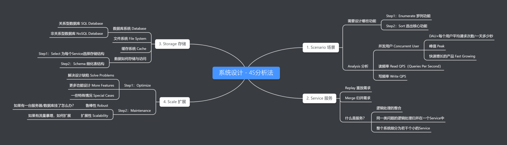

- [设计模式七大原则](#设计模式七大原则)
- [工厂](#工厂)
- [策略和简单工厂组合](#策略和简单工厂组合)
- [代理](#代理)
- [建造者](#建造者)

## 系统设计类问题应该如何作答
* 可行解 Work Solution 25%
* 特定问题 Special Case 20%
* 分析能力 Analysis 25%
* 权衡 Tradeoff 15%
* 知识储备 Knowledge Base 15%

4S分析法中的4S是指Scenario（场景），Service（服务），Storage（存储），Scale（扩展）。

如何设计一个推特？

第一步：Scenario 场景
在这一步，你需要询问面试官：需要设计哪些功能（也可以自己想），需要承受多大的访问量？

首先可以把Twitter的功能一个个罗列出来，很显然你无法在45分钟的面试中完成所有功能的设计，所以需要筛选出核心功能（Post a Tweet，Timeline，News Feed，Follow/Unfollow a user，Register/Login）。

然后有的面试官可能会问你系统承受的QPS大概是多少？需要考虑并发用户，读频率（Read QPS）以及写频率（Write QPS）。

分析QPS有什么用？
* 如果QPS = 100，那么用你的笔记本作Web服务器就好了；
* QPS = 1K，一台好点的Web 服务器也能应付，需要考虑Single Point Failure；
* QPS = 1m，则需要建设一个1000台Web服务器的集群，并且要考虑如何Maintainance（某一台挂了怎么办）。

QPS 和 服务器/数据库之间的关系
* 一台Web Server承受量约为 1K的QPS（考虑到逻辑处理时间以及数据库查询的瓶颈）；
* 一台SQL Database承受量约为 1K的QPS（如果JOIN和INDEX query比较多的话，这个值会更小）；
* 一台 NoSQL Database (Cassandra) 约承受量是 10k 的 QPS；
* 一台 NoSQL Database (Memcached) 约承受量是 1M 的 QPS。

第二步，Service服务

所谓服务可以认为是逻辑处理的整合，对于同一类问题的逻辑处理可以归并到一个服务中。这一步实际上就是将整个系统细分为若干个小的服务。
根据第一步选出的核心功能，我们可以将推特拆分成如下的几个服务：
* User Service
    * Register
    * Login
* Twitte Service
    * Post a tweet
    * New Feed
    * Timeline
* Media Service
    * Upload Image
    * Upload Video
* Friendship Service
    * Follow
    * Unfollow

第三步，Storage 存储

接下来就是4S分析法中最重要的一部分，存储。根据每个服务的数据特性选择合适的存储结构，然后细化数据表结构。
系统设计中可以选择的存储结构一般有三大类：数据库系统，文件系统，缓存系统。其中数据库系统又分为关系型数据库（SQL Database）和非关系型数据库（NoSQL Database）。
确定存储结构后，我们需要细化数据表结构，面试中可以通过画图展示数据存储和读取的流程。
用过前3个步骤的分析，我们已经得到了一个可行方案，注意是Work Solution而不是Perfect Solution，这个方案可以存在很多待解决的缺陷。

第四步，Scale 扩展。
包括系统的鲁棒性和扩展性，比如有一台服务器/数据库挂了怎么办？如果有功能和业务的新增，如何扩展？
**更多功能设计**  
随着用户需求的发展和市场变化，系统可能需要引入新功能。这时候，设计新功能必须考虑到系统的整体架构，确保新增功能能够无缝集成，并且不会对现有功能造成干扰。

**系统鲁棒性**  
鲁棒性是指系统在面临错误输入或环境变化时仍能持续稳定运行的能力。系统维护工作包括监控系统状态，修复故障，更新软件以修补安全漏洞等。

**单点故障**  
如果服务器/数据库出现故障，系统需要有备份和故障转移方案。这通常涉及设立冗余系统，如通过数据库复制和负载均衡等技术，确保即便单点故障发生也不会影响整个服务。

**流量暴增的扩展性**  
面对流量激增的情况，系统应该具备自动或半自动扩展的能力。这通常涉及以下几个方面：

- **水平扩展（Horizontal Scaling）**：增加更多的服务器来分散负载。
- **垂直扩展（Vertical Scaling）**：升级现有服务器的硬件性能，如CPU、内存等。
- **云服务的弹性伸缩**：利用云计算服务的弹性伸缩功能，根据实时流量动态调整资源分配。
- **缓存策略**：使用缓存来减少数据库访问频率，提升响应速度。
- **负载均衡**：使用负载均衡器分发请求，确保没有单一服务器承担过多的压力。

## 设计模式七大原则
1) 单一职责原则：一个类应该只负责一项职责。
2) 接口隔离原则：客户端不应该依赖它不需要的接口
3) 依赖倒转(倒置)原则：程序要依赖于抽象接口，不要依赖于具体实现
4) 里氏替换原则：父类中凡是已经实现好的方法，实际上是在设定规范和契约
5) 开闭原则：模块和函数应该 对扩展开放( 对提供方)，对 修改关闭( 对使用方)。
6) 迪米特法则：一个对象应该对其他对象保持最少的了解
7) 合成复用原则：尽量使用合成/聚合的方式，而不是使用继承

工厂 代理 建造者 适配器 装饰器，策略、门面、观察者、单例

## 工厂
简单工厂会打破开闭原则，可以用工厂模式，但是会产生大量的类
你可以避免创建者和具体产品之间的紧密耦合。

    单一职责原则。
    开闭原则。 
    应用工厂方法模式需要引入许多新的子类， 代码可能会因此变得更复杂。 最好的情况是将该模式引入创建者类的现有层次结构中。

简单工厂会有复杂的 switch分支运算符， 用于选择各种需要实例化的产品类。 \
用工厂模式就可以了

    产品基类：
    各种产品类：
    工厂基类：依赖产品基类，接口返回一个产品基类的对象
    各种工厂类：继承工厂基类，接口返回各种产品的对象
    客户端：new一个具体的工厂类给工厂基类的指针，调用接口获得具体的产品。

## 策略和简单工厂组合
    产品基类：
    各种产品类：
    context类：产品基类的聚合（成员变量），通过switch各种产品类，接口直接返回这个产品类的输出
    客户端：new context类，传入产品参数，通过context获得产品的结果
简化了单元测试，但是还是有switch，需要用工厂模式的反射才能具体消除

## 代理
    共同接口类subject：定义了`realsub`和proxy的公共接口\
    realsub: 实现`subject`接口\
    proxy：`realsub`是它的成员变量，它对`subject`接口的实现直接是调用`realsub`的接口\
    客户端：使用proxy的接口即可

应用：网页打开本身很快，但打开图片很慢，就是一种代理。或者智能指针也是代理，在访问对象时还要附加内务处理比如改变count

## 建造者
    BuilderBase: 是一个纯虚接口类，需要BuilderDerived来实现\
    BuilderDerived: 实现各种形态，但不在构造函数里做东西\
    Director: BuilderBase作为成员变量，每个形态都要做的事情，包装到一个函数func里，由它来统一完成\
    客户端：new 各种形态的BuilderDerived，交给Director初始化传参，执行func函数来build完成

[1.什么是设计模式](https://github.com/colinlet/PHP-Interview-QA/blob/master/docs/09.%E8%AE%BE%E8%AE%A1%E6%A8%A1%E5%BC%8F/QA.md)

2.如何理解框架
3.主要设计模式
4.怎样选择设计模式
5.单例模式
6.抽象工厂模式
7.工厂方法模式
8.适配器模式
9.观察者模式
10.策略模式
11.OOP 思想
12.抽象类和接口
13.控制反转
14.依赖注入
依赖注入是 将 所依赖的 传递给 将使用的从属对象（即客户端）。该服务是将会变成客户端的状态的一部分。 传递服务给客户端，而非允许客户端来建立或寻找服务
